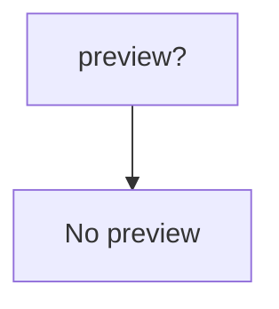

# Triple send

<p align="center">
    
    
    
    <br/>



</p>

[//]: # (    )

##### Версия для русских: [здесь](./README_RU.md)


### How to run

```python

```

## Links

* [Author's Telegram](https://t.me/SantaSpeen "SantaSpeen"): https://t.me/SantaSpeen

Used in: 

* [Python-CLI-Game-Engine](https://github.com/SantaSpeen/Python-CLI-Game-Engine)
* [CLI-Remote-in-Python](https://github.com/SantaSpeen/CLI-Remote-in-Python)
