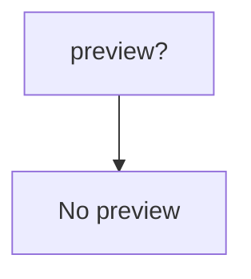
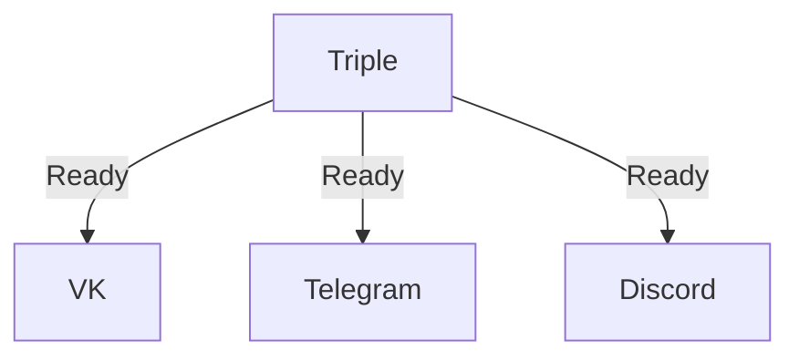

# Triple send

<p align="center">
    <a href="https://github.com/SantaSpeen/Triple-send/blob/master/LICENSE"></a>    
    <a href="https://github.com/SantaSpeen/Triple-send/stargazers"></a>    
    <a href="https://github.com/SantaSpeen"></a>
    <br/>




</p>


### Как запускать

```python

```

## Ссылки

* [Мой Telegram](https://t.me/SantaSpeen "SantaSpeen"): https://t.me/SantaSpeen

Используемые в проектах: 

* [Python-CLI-Game-Engine](https://github.com/SantaSpeen/Python-CLI-Game-Engine)
* [CLI-Remote-in-Python](https://github.com/SantaSpeen/CLI-Remote-in-Python)
