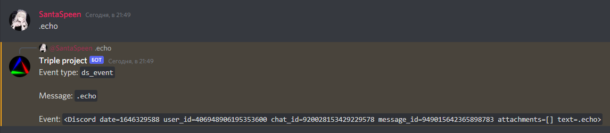
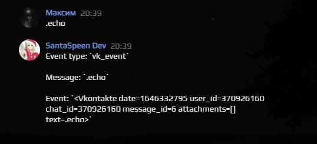
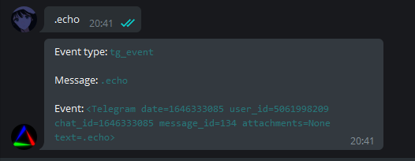

# Triple send

<p align="center">
    <a href="https://github.com/SantaSpeen/Triple-send/blob/master/LICENSE"></a>    
    <a href="https://github.com/SantaSpeen/Triple-send/stargazers"></a>    
    <a href="https://github.com/SantaSpeen"></a>
    <br/>
    <a href="./src/main.py">
        
        <br/>
        
        <br/>
        
    </a>
    <br/>
</p>


Demo:

* Telegram: @Triple_project_bot
* Discord:  Triple project#0877
* Vkontakte: @dev.santaspeen


### Как запускать

```python
import triple

# default vk_api_version is 5.131
tr = triple.Triple(
    vk_token="Token here",  # Default None
    tg_token="Token here",  # Default None
    ds_token="Token here",  # Default None
    prefix=".",  # default '.'
    config_path="./config/polling.json" # Default './config/polling.json'. This mean <project_folder>/config/polling.json'.
)


@tr.on_message("echo")
def bot_echo(event_type: str, event: triple.types.MessageObject):
    """ example """

    # Triggered from '.echo'

    # Available event_types:
    # tg_event
    # vk_event
    # ds_event

    if event_type == "vk_event":
        return f"Event type: {event_type}\n\nMessage: {event.text}\n\nEvent: {event!r}"

    return f"Event type: `{event_type}`\n\nMessage: `{event.text}`\n\nEvent: `{event!r}`"


@tr.on_message(r"((?:\.help|/help|/start))", regex=True)
def bot_help(event_type: str, event: triple.types.MessageObject):

    message = "Help:\n1: .echo {0}<some text>{0}"

    if event_type == "vk_event":
        return message.format("")

    return message.format('`')


@tr.on_event
async def all_events(event_from: str, event):
    print(event_from, event)


if __name__ == '__main__':
    tr.run()
```

## Ссылки

* [Мой Telegram](https://t.me/SantaSpeen "SantaSpeen"): https://t.me/SantaSpeen

Используемые в проектах: 

* [Python-CLI-Game-Engine](https://github.com/SantaSpeen/Python-CLI-Game-Engine)
* [CLI-Remote-in-Python](https://github.com/SantaSpeen/CLI-Remote-in-Python)
